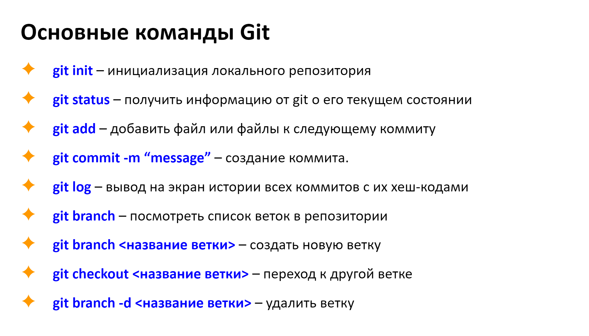
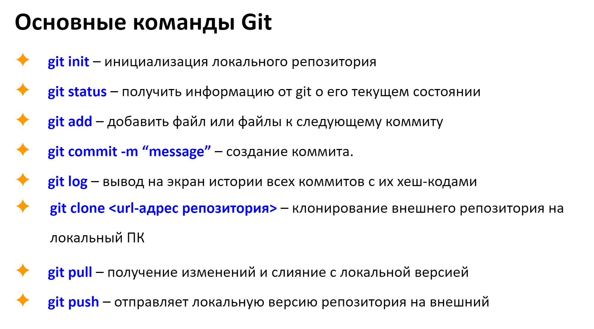

1. Создаем папку-репозиторий
2. В VSC выбираем open folder и открываем нужную папку
3. Open in integrated Terminal
4. Для проверки, работает ли Git корректно, вводим команду **git init**
5. Создаем **New file** в поле **Explorer**. Даем имя файлу. Обязательно в имени файла ввести **.md**. Созданный файл будет гореть зеленым цветом.
6. команда **git status** показывает, где сейчас находимся. После вывода информации, имя файла в поле терминала будет гореть красным цветом - это нормально.
7. Во вкладке с открытым файлом будет стоять точка, что означает, что файл не сохранен. Чтобы сохранить изменения нажать *Ctrl+S*. Прежде, чем делать коммиты, файлы всегда сохранять
8. Для создание коммита нужно создать свою учетную запись
**git config --global user.name NAME**
**git config --global user email 'почтв"**
После введения команды не должно вылезать ошибок.
9. Отправляем файл на индексацию с помощью команды **git add**/ После add нужно ввести имя файла. Сделать это можно вручную или перебором с помощью Tab.
После введения команды не должны выходить ошибки.
10. Чтобы посмотреть, что изменилось вводим команду **git status**. FisrtFile в терминале теперь горит зелееым. Это значит, что файл отправлен на индексацию и готов к коммиту.
11. **git commit -m "информация о коммите"**
После того, как коммит совершен, можно проверить git status, там теперь ничего нет.
12. **git log** - позволяет посмотреть коммит. В коммите сохраняется именно состояние файла.
Все действия выше могут повторяться.
13. **git checkout** позволяет перемещаться между коммитами. 
Обязательно перед началом работы смотреть, где находишься.
14. К актуальному коммиту возвращает команда **git checkout master**
15. **git diff** позволяет увидеть разницу между текущим состоянием файла и тем, что сохранено в коммите.
16. В терминале по предыдущим командам можно перемещаться с помощью ↓ и ↑. 

